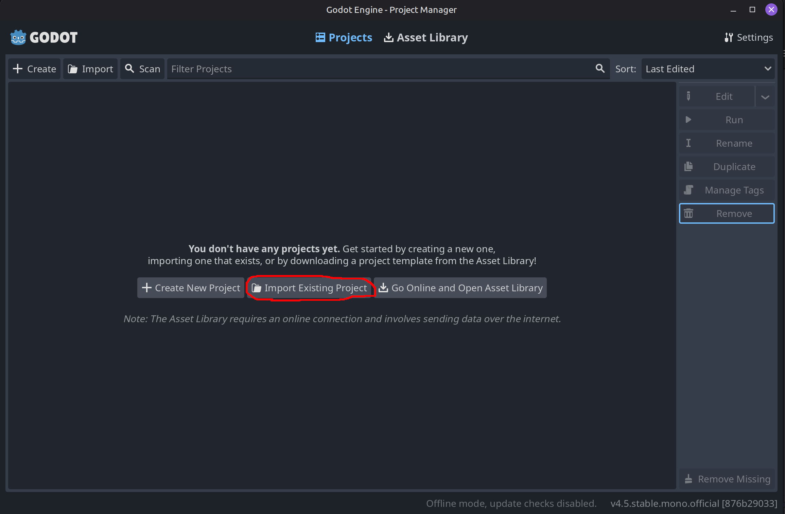
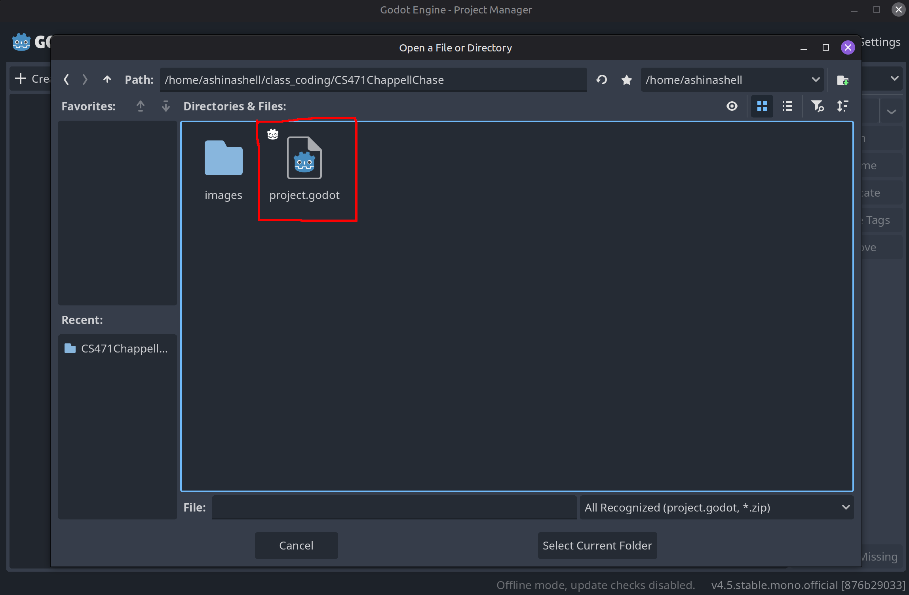
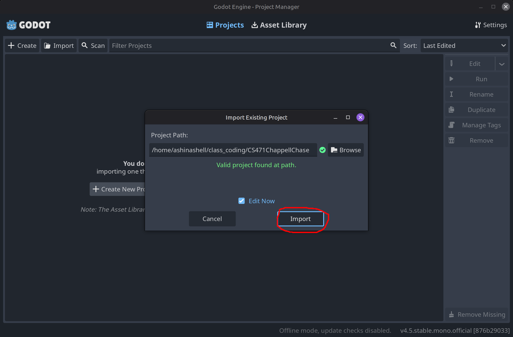
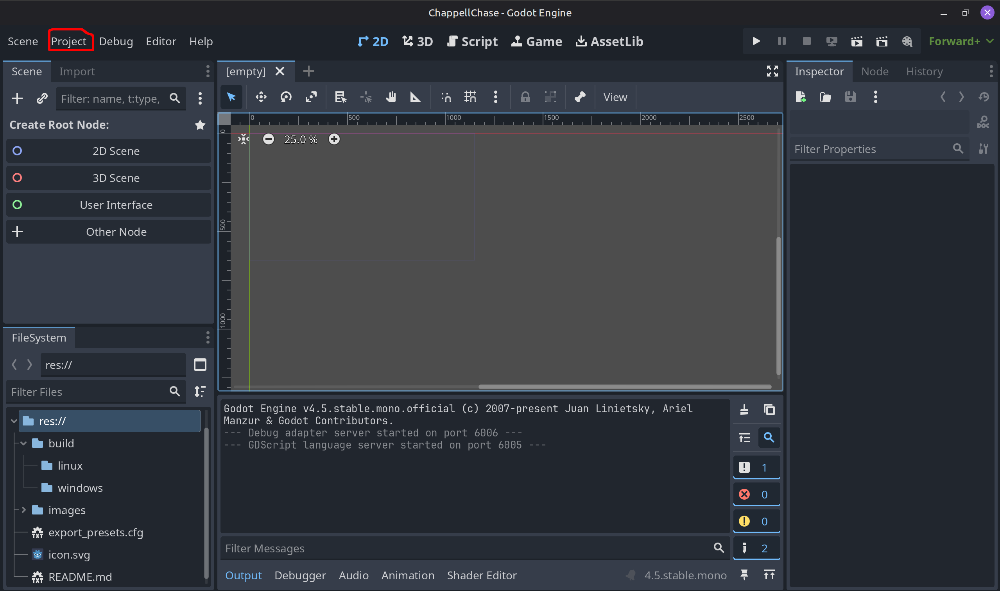
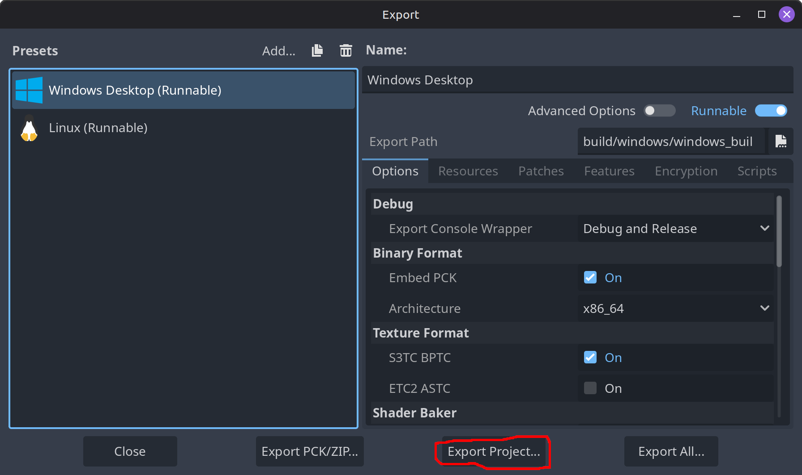
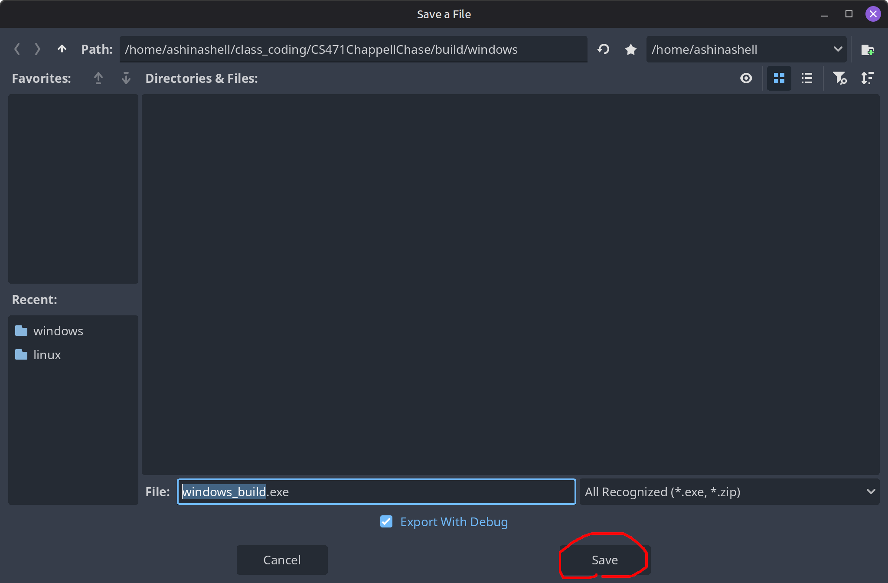

# ChappellChase game for CS471

## How To Use

### Install and Run Godot

1. Download from [Godot's website](https://www.godotengine.org/download/)

2. Extract Godot binary

3. Run Godot binary

### Import project in Godot
1. Once Godot has loaded, click `Import Existing Project` to import the project

2. Navigate to the project repository directory and select project file

3. Finish the import by clicking the Import button

## Building Executables

To build an executable for the project in Godot, first open the editor

Once the Godot editor has been opened, navigate to the project tab on the top toolbar in Godot

Next, select `Export...` in the drop down menu

In the next menu, select which operating system and architecture to build for

Next click `Export Project...` and navigate to the specific build folder in the repository and name the executable

Once finished, click `Save`

