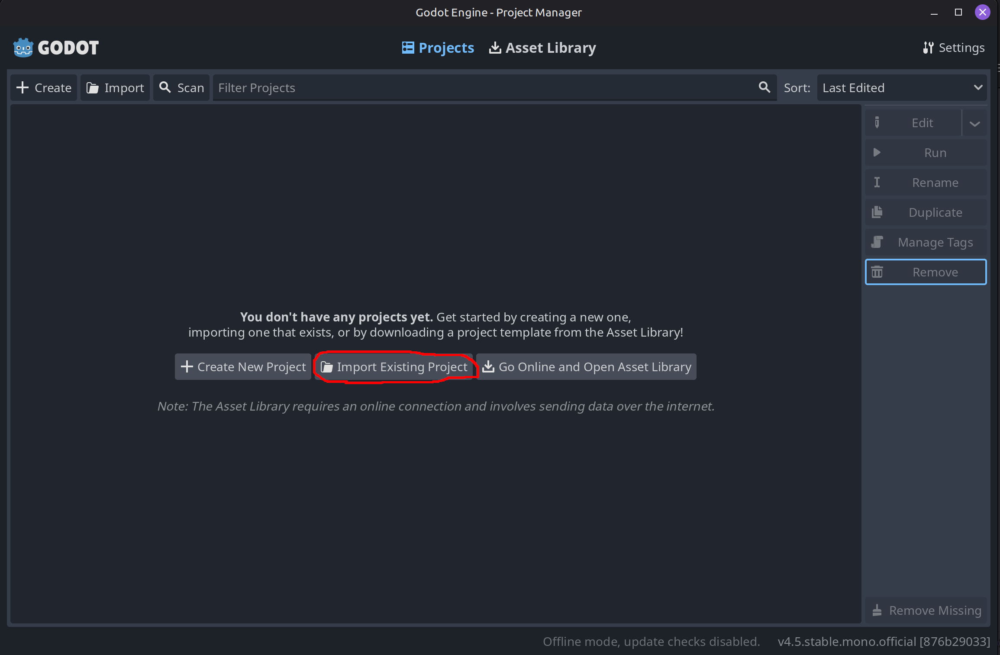
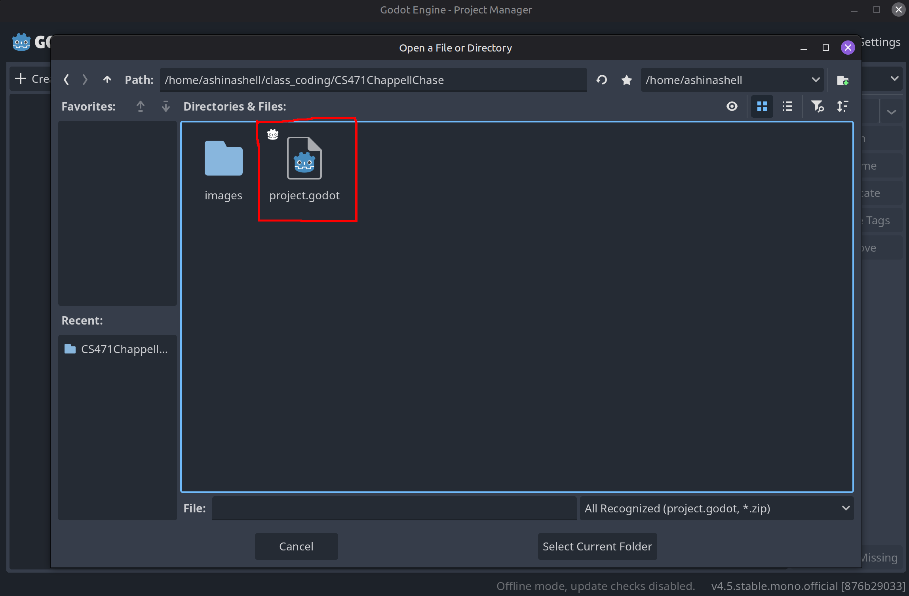
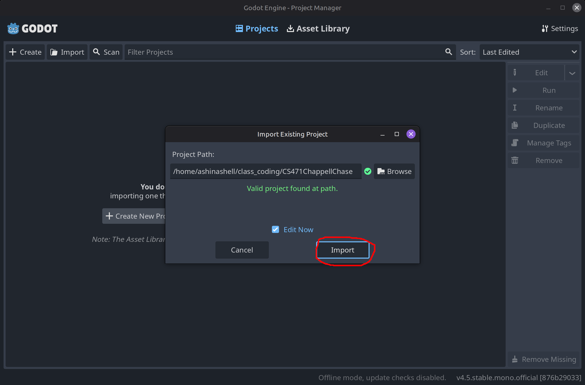
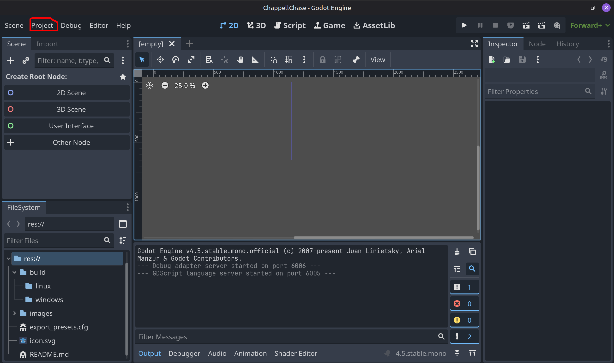
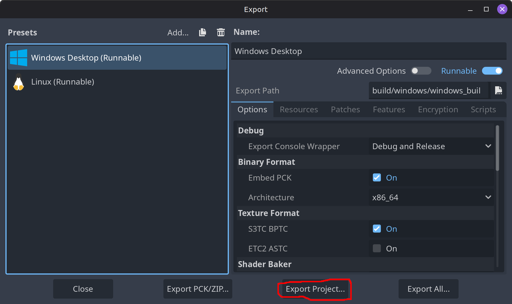
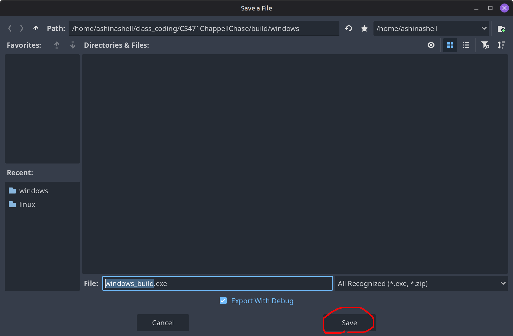

# ChappellChase
By Jenae Matson, Cleary Bettisworth, Ashley Moore-Schultz, and Ryland Sacker
Created for the course CS471 Senior Capstone

ChappellChase is a sorting algorithm studying game. You play as a hampster escaping a CS professor's basement, using sorting algorithms to put stairs back into a climbable order, ideally the fastest algorithm so as to escape faster. There is also a practice mode to see all the sorting algorithms in action.

## Play the Game

1. Go to the `build` folder and then the folder corresponding to your operating system.

2. Download the executable file.

3. Play and enjoy!

## How To Start Contributing to Development

### Install and Run Godot

1. Download from [Godot's website](https://www.godotengine.org/download/)

2. Extract Godot binary

3. Run Godot binary

### Import project in Godot
1. Once Godot has loaded, click `Import Existing Project` to import the project

2. Navigate to the project repository directory and select project file

3. Finish the import by clicking the Import button

### Building Executables

To build an executable for the project in Godot, first open the editor

Once the Godot editor has been opened, navigate to the project tab on the top toolbar in Godot

Next, select `Export...` in the drop down menu

In the next menu, select which operating system and architecture to build for

Next click `Export Project...` and navigate to the specific build folder in the repository and name the executable

Once finished, click `Save`

### Linting

Follow this [link](https://github.com/Scony/godot-gdscript-toolkit) to apply godot linter formatting to code
